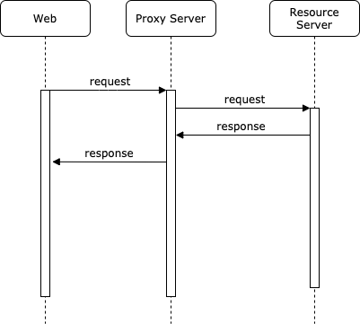

# Same-Origin Policy

***Same-Origin Policy*** restricts how a document or script loaded from one origin can interact with a resource from another origin.

The same-origin policy controls interactions between two different origin.

## What Is Origin?

Origin = scheme + host + port

## Cross-Origin Network Access

1. Cross-origin writes are typically allowed. Some HTTP requests require preflight.
    - Links
    - Redirects
    - Form submissions
2. Cross-origin embedding is typically allowed.
    - JavaScript with ``. Error details for syntax errors are only available for same-origin scripts.
    - CSS applied with `<link rel="stylesheet" href="…">`. Due to the relaxed syntax rules of CSS, cross-origin CSS requires a correct Content-Type header.
    - Images displayed by ``.
    - Media played by `<video>` and `<audio>`.
    - External resources embedded with `<object>` and `<embed>`.
    - Fonts applied with `@font-face`. Some browsers allow cross-origin fonts, others require same-origin.
    - Anything embedded by `<iframe>`. Sites can use the X-Frame-Options header to prevent cross-origin framing.
3. Cross-origin reads are typically disallowed.
    - But read access is often leaked by embedding.
        - Read the dimensions of an embedded image.
        - The actions of an embedded script.
        - The availability of an embedded resource.

## What Does Browsers Do

Browsers still send request to the resource server for you. \
However, browsers **block the response** and send error to Javascript script.

## How To Allow Cross-Origin Access

### 1. no-cors

As the error you see on the developer console, you can set fetch mode to `no-cors`. \
It mitigates the CORS error, but it does **NOT** solve the root cause. \
In fact, it tells the browser to **block my frontend JavaScript code from looking at contents of the response body and headers** under all circumstances. \
`no-cors` mode only allows a limited set of headers in the request: \
    1. `Accept` \
    2. `Accept-Language` \
    3. `Content-Language` \
    4. `Content-Type` with a value of `application/x-www-form-urlencoded`, `multipart/form-data`, or `text/plain`.
Other request headers will be stripped.
> No 'Access-Control-Allow-Origin' header is present on the requested resource. If an opaque response serves your needs, **set the request's mode to 'no-cors'** to fetch the resource with CORS disabled.

### 2. Proxy Server

Same-origin policy **ONLY restricts browsers!** \
Thus, by setting up a proxy server, you can bypass same-origin policy. \

    a. Web -> Proxy Server
    b. Proxy Server -> Resource Server
    c. Proxy Server <- Resource Server
    d. Web <- Proxy Server
You can add any response header you want on proxy server.

### 3. CORS

Use **CORS** to allow cross-origin access.

## References

1. [MDN Web Docs Same-Origin Policy](https://developer.mozilla.org/en-US/docs/Web/Security/Same-origin_policy)

## [HackMD](https://hackmd.io/@r04922101/SylRxuclu)
